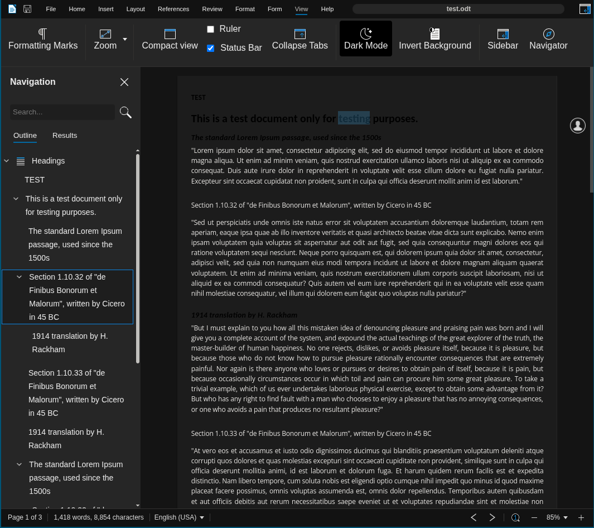
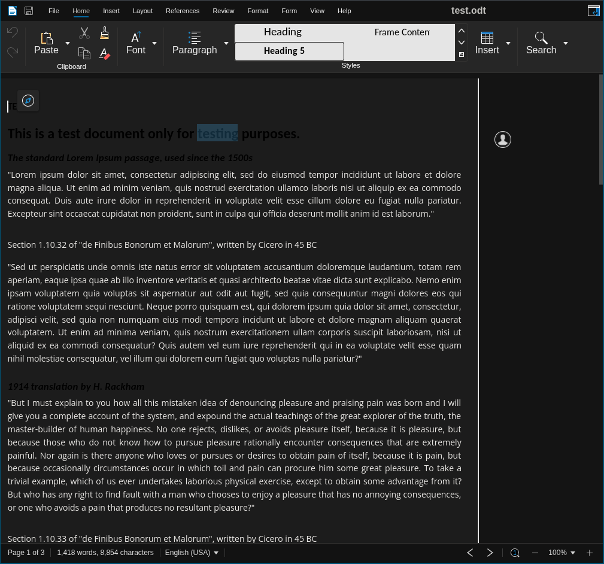

## 2026-01-16 Dynamically set initial document zoom

Previously we set 100% initial zoom on the document in `_fitWidthZoom`,
now we calculate the maximum possible zoom based on window/canvas size.
Most of the work is done in `_fitWidthZoom`.

### The Resize Problems

Ideally we would want to reset the document zoom when a sidebar shows
up or when the user snaps the window to some edge. An attempt was
made to do so by checking for large resizes in `_fitWidthZoom` to
invalidate the **firstFit** zoom calculations, but this didn't work
because the *previous work around comments* also listens for resize
events & their interaction has some assumptions like "the margins are
evenly divided on both sides of the document". 

Let's say the document is opened in a small window and the navigator
is visible. The document has almost no space on either side. When
the navigator is closed, the resize event is fired & the *previous
work around comments* assumes that the extra space left behind by the
navigator is evenly divided on both sides, so it just assumes that
we can move the document to the left by half that total space & the
comments will be fully visible. The whole empty space is (will be
added) on the left (before calling re-center).

This is considered a large resize, so the `_fitWidthZoom` also
increases the zoom & then `ViewLayoutWriter` code scrolls the document
to the left. It would have been fine if zoom listened to resize &
changed the zoom & then the `ViewLayoutWriter` code calculated the
margins, or the other way around, but they both prepare to modify the
zoom/scroll on resize and when they do, we get a document which is
scrolled off the visible area on the left side because we zoomed the
scrolled document or the other way around.

### Problems related to Annotations

It would be ideal to show the comments in full width (than collapsed)
when the window width is large enough to show the document at zoom
levels >= 120%. But the comments haven't been imported when the first
fit calculations are done. So there's no way of knowing whether
comments are there or not in the first place.

@printfdebugging tried fixing this by listening for 'importannotations'
event to recalculate the firstFit zoom, but this didn't work out for
some reason. TODO: find why it didn't work out.

## Previous work around comments

`ViewLayoutWriter` class inherits from `ViewLayoutBase` & scrolls the
document to the left to make some space for the comments. By default
the document is centered with equal amount of margins on both the left
and the right (and the comments section on the right margin).

`ViewLayoutWriter` listens for `zoom`, `resize` and `annotation`
events and fires callbacks which scroll the document to the left, or
recenter it based on the window size & whether comments are present
and not toggled off.

    One noticable issue with this approach is that when we resize
    the window, there is another listener somewhere which recenters
    the document. So during resize, the document oscillates between
    the center and the "scrolled off" position.

This can be fixed by coordinating between the two listeners so that
they know that the other one will take care of this resize event. But
this solution doesn't scale.

<!-- vim:tw:72 -->
